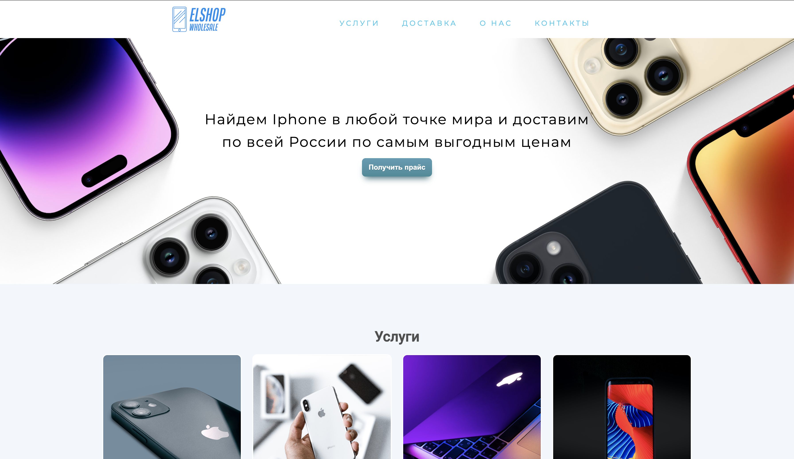
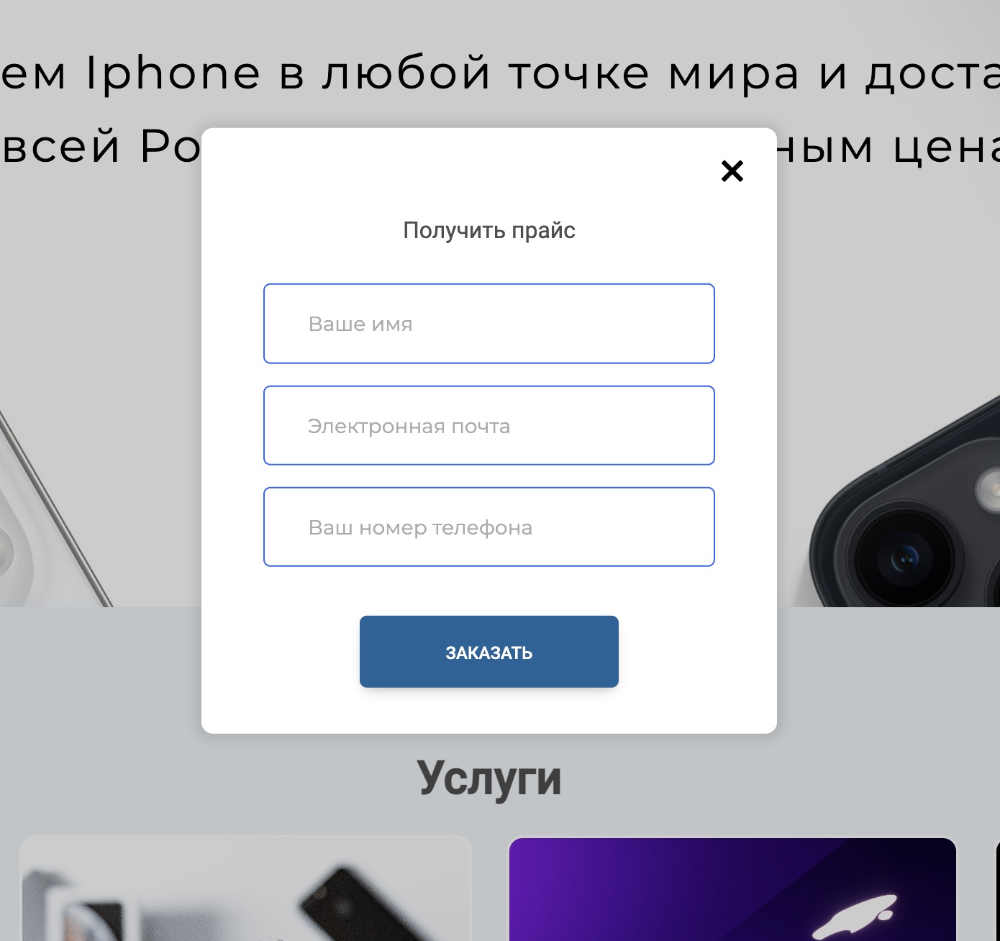

https://anisinaaleksandra.github.io/usedAppleStore/

# Apple Store

This project was generated with [Angular CLI](https://github.com/angular/angular-cli) version 15.1.4.

- Меню настроено со скролом, есть анимация при наведении

- Адаптивная верстка

## Модальное окно

- форма отправляется сразу в телеграм-бот
- валидация формы перед отправкой
- подсветка ошибок полей с сообщениями

- стили scss
- использованы переменные в стилях

## Development server

Run `ng serve` for a dev server. Navigate to `http://localhost:4200/`. The application will automatically reload if you change any of the source files.

Run `ng build` to build the project. The build artifacts will be stored in the `dist/` directory.
